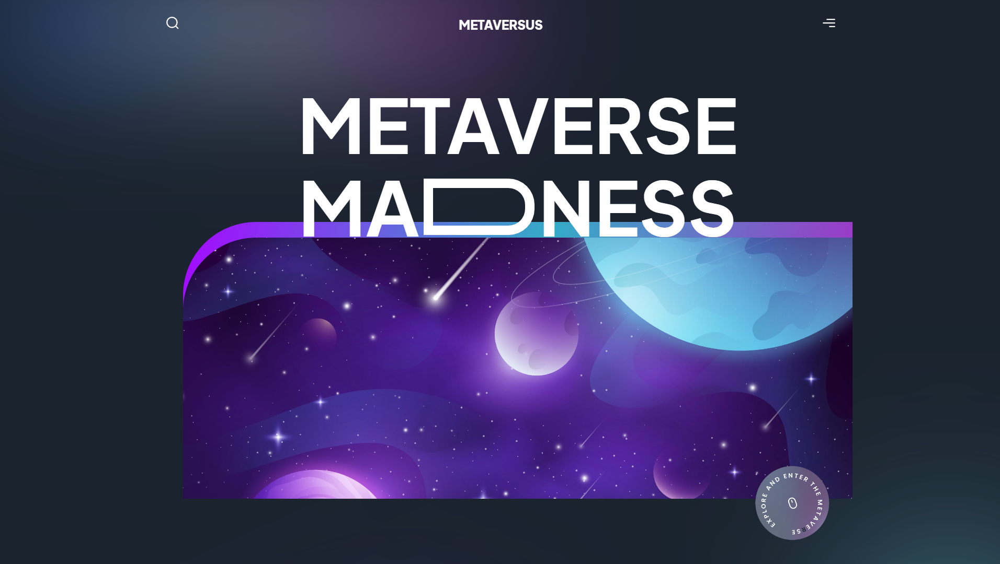

# Metaversus Madness 
   

Metaversus Madness - responsive landing page with beautiful animations using Framer Motion and modern UI. (Next.js, TailwindCSS, React.js) [Website🍿](https://metaversuslanding.vercel.app)

